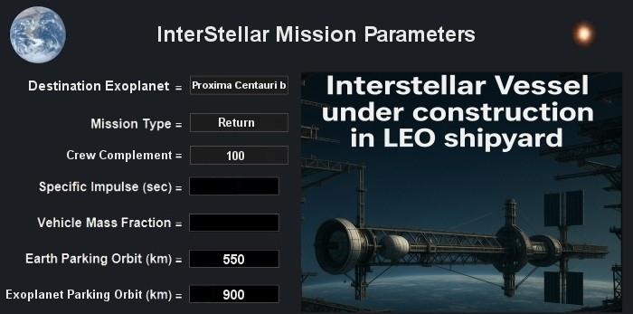
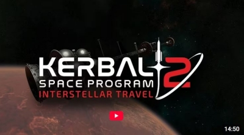

# ISV Enterprise

  

Welcome onboard the ISV Enterprise. This porject is an attempt to virtually build a starship for an exploratory scientific mission to survey the surface of the known exoplanet [Proxima Centauri b](https://en.wikipedia.org/wiki/Proxima_Centauri_b). Distance: 4.2 ly. Crew complement: 100. The mission will allow most of the crew to be able to return to Earth within their lifetimes except for the more mature crew who might need to sign a waiver however cryosleep may also be an option. The starship model has to be theoretically sound and accurate in that it has to comply with current known propulsion physics and engineering rules and be practical to build in real life if this were a real build at a Low Earth Orbit shipyard with an international collaboration between many nations over several decades. Some educated guesses and interpolation may be allowed as many technologies required for the starship haven't been built yet. 

ISV Enterprise will have the following features (items are marked either <I>Negotiable</I> or <I>Compulsory</I>):

- Length Overall (LOA) shall not exceed 1,200 m. <I>Negotiable</I>
- Artificial gravity rotating habs for the crew section @1g. <I>Compulsory</I>
- Passive and Active shield systems to mitigate space radiation exposure for the crew. <I>Compulsory</I>
- Substantial dust shield. At moderate relativistic velocities a grain of interplanetary or interstellar dust could cause damage to the ship, use the sacrificial dust shield to take the hits instead of the ship. Use ISRU methods to repair the shield using resources from the star system or exoplanet when required. There is a price to pay though as this is amounts to a substantial overall mass increase to the ship. <I>Compulsory</I>
- High performance propulsion systems, lots of options and hybrid combinations possible. For the purposes of this article we'll set the minimum requirements for the main propulsion system to have an Isp at least 400,000 s @100 kN thrust or higher Isps with lower thrust in combination with other propulsion systems that can deliver high thrust when required for orbital manoeuvres etc. This would mean NTP, NEP for eg for the main drive are rulled out however potentially could be used as auxiliary propulsion systems. To meet the above requirement we'll need to use NFP or MAP or other propulsion systems that meet our criteria preferably with an Isp > 15,000,000 s. Minimum three main propulsion drives are required for redundancy. The ship will also need many gaseous H₂ / O₂ RCS (Reaction Control System) vernier thrusters for fine manoeuvres such as when undocking/docking from/to the orbital shipyard. When it comes to interstellar travel, when transporting people, speed is of the essence. <I>Negotiable</I>
- MultiMegaWatt ultra-reliable microreactors to power all the systems onboard, would need to be compulsory, 10 MW(e) as a minimum, however this would depend on the final design of the spacecraft. These would have to be robust, requiring minimal maintenance and spare nuclear fuel would need to be brought along for refuelling when required. Potentially the main propulsion drive could also be used to provide electrical power for the spacecraft when in use. Solar panels are of no practical use beyond Jupiter and between the stars. There needs to be three separate microreactors onboard for redundancy. <I>Negotiable</I>
- Thermal radiators (heat sinks) to radiate away excess heat from the spacecraft as infrared energy into space. This is required for the cooling system for the propulsion system, microreactors and everything else that needs cooling onboard such air handling units for the crew quarters, propellant Cryogenic Fluid Management systems etc, lots of options here, some use fluid loops to transfer heat and large radiators can also be deployed via fold out structures. How many and how large the radiators need to be will be determined by the efficiency of the power conversion systems and power required. <I>Compulsory</I>
- Being a crewed mission, we need humans onboard. Robotics and cryosuspension systems for some of the crew may be an option during the transit to save on resources. For the purposes of this article we'll assume a crew of 100 for a viable (non-generational) exploratory interstellar mission however see the Andreas Hein interview below. We'll need at least crew for Command/DeckOps/Shuttle Pilots&Co-Pilots, Navigation/Astrodynamics, Life Support including Hydroponics, Medical/BioSafety, IT/Robotics, Engineering, Galley/Hospitality, Scientists for the various fields including exoplanetary scientists, exobiologists etc and other crew as per mission requirements. The spacecraft needs to have enough resource capacity to sustain the crew + any potential newcomers that are born on the way. <I>Negotiable</I>
- Two transport shuttles to bring scientists and crew to the exoplanet surface for scientific research. One shuttle is used at a time, the other stays with the mother ship as a backup / rescue option. The shuttle has to be able to descend to the exoplanet surface (if possible) and liftoff back to LEO on its own as there is no infrastructure refuelling option on the planet. The shuttles can also accomodate some crew if there is a major emergency that requires abandoning the mother ship. <I>Compulsory</I>
- Two long range ISRU multicat space tugs with CFM IBCs (Cryogenic Fluid Management Intermediate Bulk Containers) to get crew to where H20 water ice is located in the system (preferably in an asteroid field with low gees) to use In Situ Resource Utilisation fully automated mining units to extract LOX and LH2 from H20 into the IBCs and transport these back to the mother ship to refill its CFM propellant and water tanks. The primary mission of the ISRU crew is to locate, extract and transport these and other resources to replenish the mother ship's tanks. LH2 and HydroLOX is the primary fuel used for the shuttles, tugs and also used for the manoeuvring thrusters of the mother ship. These long range space tugs can sustain the small crew for weeks away from the mother ship. They can also assist with other tasks such as ship maintenance/repair and be used to accomodate some crew if there is a major emergency that requires abandoning the mother ship. <I>Compulsory</I>
- Communications antenna array including a substantial parabolic dish for long distance (delayed) communications back to Earth and other antennae/smaller dishes for close range communications with the shuttles when required, proximity radars and AI integrated TCAS (Traffic Collision Avoidance System), in this case debris and rocks along the way. <I>Compulsory</I>
- Compact 6 m diameter telescope with a full astronomical scientific instrument suite. The primary segmented mirror is able to be folded when not in use. No interstellar explorer should venture into the galaxy without a telescope, being on a starship is no excuse. This is to gather as much data as we can prior to arrival in the star system. Finding water ice prior to arrival in the system would be very helpful. <I>Negotiable</I>
- More features will be added as required once the final design is ironed out (keeping mass, delta vees etc in mind). For eg there is a possibility that a 500 m diameter segmented mirror may be added at the front of the starship combined with the dust shield to use Photonic Laser Propulsion (PLP) for initial acceleration in the vicinity of the solar system from the high power base laser transmitter in addition to the 3 antiproton-beryllium-beam-core Matter Antimatter Propulsion (MAP) engines and 4 antiproton-catalyzed-aneutronic Nuclear Fusion Propulsion (NFP) auxiliary engines however looking into the details. <I>Negotiable</I>

Project background location: https://www.linkedin.com/pulse/advanced-propulsion-resources-22-paul-titze-su26c/

This author will be using a combination of [KSP 1.12.5](https://store.steampowered.com/app/220200/Kerbal_Space_Program/) with mods and imported custom made starship parts modelled in [Blender](https://www.blender.org/) to assist with visualisations (see [Part 1](https://www.linkedin.com/pulse/advanced-propulsion-literature-paul-titze-9a57c/) of the above article if you're not familiar with KSP). A full Blender model will also be available for cinematic renders in this repo. Note that this author is also keeping a close eye on developments of [Kitten Space Agency](https://kittenspaceagency.wiki.gg/) which is the [spiritual successor to KSP2](https://www.youtube.com/watch?v=DO11l8wNQNg) with some of the original KSP developers working on this new space simulation game. More significantly KSA will also have interstellar travel.

Early renders and progress reports will be added to this repo. This is an Open Source community based project so anyone is welcome to contribute via the Discussions section, suggestions, what features you think the starship should have, useful papers to refer to etc. Pull requests are also welcome from contributor starship builders when the early Blender files become available in this repo if the physics and engineering modifications are sound.

Useful reference papers:
 
- [How to build an antimatter rocket for interstellar missions](https://dataverse.jpl.nasa.gov/dataset.xhtml?persistentId=hdl:2014/38278) - systems level considerations in designing advanced propulsion technology vehicles, by Robert H. Frisbee.
- [Aneutronic Fusion Propulsion](https://www.dia.mil/FOIA/FOIA-Electronic-Reading-Room/FileId/170024/), Defense Intelligence Reference Document (unclassified), DIA.
- [Recommended Design Practices for Conceptual Nuclear Fusion Space Propulsion Systems](https://forum.nasaspaceflight.com/index.php?action=dlattach;topic=60353.0;attach=2280551), Special Project, AIAA.
- [Prospective of Photon Propulsion for Interstellar Flight](https://www.researchgate.net/publication/268423813_Prospective_of_Photon_Propulsion_for_Interstellar_Flight), by Young K. Bae.

   

Cheers, [Paul Titze](www.linkedin.com/in/paul-titze-3794502b). 
ISV Enterprise Chief Engineer. 

