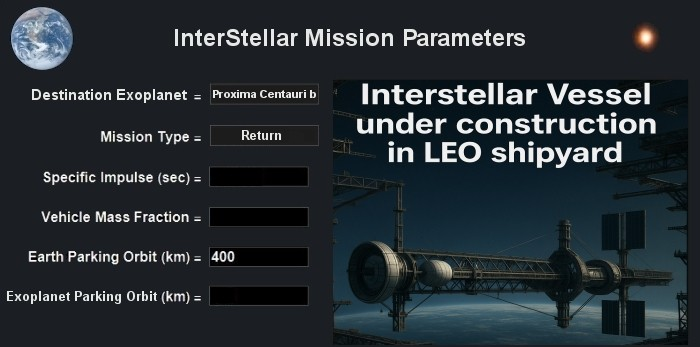

# ISV Enterprise

> *Spaceflight as we know it, is based on the century old rocket equation that is the embodiment of the conservation of linear momentum. Current space transportation systems are based on this principle of momentum generation, regardless whether they are chemical, electric, plasma-dynamic, nuclear (fission) or fusion, antimatter, photonic propulsion (relativistic) and photon driven (solar) sails, or exotic Bussard fusion ramjets. Moreover, special relativity puts an upper limit on the speed of any space-vehicle in the form of the velocity of light in vacuum. The only possibility to overcome these severe limitations lies in the finding of novel physical laws that allow constructing propulsion systems based on principles different from classical mechanics (momentum principle). Therefore, there has been a great deal of interest during the last decade in so called breakthrough propulsion physics.* **Walter Dröscher & Jochem Hauser**, 2007.

  

> *And he concluded that what mankind must do to save itself is to launch an enterprise aimed at leaving the earth... The only thing I could say was this: that if I came to the conclusion that this was what mankind needed, if I wanted to  contribute something to save mankind, then I would probably go into nuclear physics, because only through the liberation of atomic energy could we obtain the means which would enable man not only to leave the earth but to leave the solar system.* **Leo Szilard**, 1932.

Welcome onboard the ISV Enterprise. This project is an attempt to virtually build a starship for an exploratory scientific mission to survey the surface of the known exoplanet [Proxima Centauri b](https://en.wikipedia.org/wiki/Proxima_Centauri_b). Distance: 4.2 ly. Crew complement: 100. The mission will allow most of the crew to be able to return to Earth within their lifetimes except for the more mature crew who might need to sign a waiver however cryosleep may also be an option. This includes a 1 Earth year time stay at Proxima Centauri b to study the exoplanet and its system. The starship 3D model has to be theoretically sound and accurate in that it has to comply with current known propulsion physics and engineering rules and be practical to build in real life if this were a real build at a Low Earth Orbit shipyard with an international collaboration between many nations over several decades. To assist in designing the ship, the theoretical groundwork will be done via the <B>Proxima Centauri b Transportation Assessment Study</B> [(PCBTAS)](PCBTAS/PCBTAS.ipynb) Jupyter Notebook following a similar format to the NASA Mars Transportation Assessment Study [(MTAS)](https://www.nasa.gov/wp-content/uploads/2023/09/mtas-study-results-final-april-03-2023-v0007-tagged.pdf). Some educated guesses and interpolation will be allowed as many technologies required for the ship haven't been built yet however the PCBTAS needs to provide enough theoretical guidance to indicate if a ship feature or propulsion system is viable in practice to allow this crewed mission to be successful. This project is also an attempt to design and build the most realistic and detailed 3D model of an interstellar starship based on physics and engineering that we know today. 

ISV Enterprise will have the following features (items are marked either <I>Negotiable</I> or <I>Compulsory</I>):

- Length Overall (LOA) shall not exceed 1,200 m. <I>Negotiable</I>
- The ship has to be able to reach a minimum peak velocity during the coast phase of 0.2c. <I>Compulsory</I>
- Artificial Gravity (AG) rotating habs for the crew quarters @1g. <I>Compulsory</I>
- AG rotating habs @1g for hydroponics and small animals in mini farms such as chickens, goats etc. For this long duration mission, all crew and animals need clean air, clean water and some fresh food in an Earth-surface-like low radiation environment. <I>Compulsory</I> 
- Passive and Active shield systems to mitigate space radiation exposure for various sections of the ship. Note Spaceship Earth provides adequate Passive shielding for its crew on the surface by an atmosphere that is equivalent to 10 m of water and an Active shield system via its geomagnetic field. <I>Compulsory</I>
- Substantial dust shield. At moderate relativistic velocities a grain of interplanetary or interstellar dust could cause damage to the ship, use the sacrificial dust shield to take the hits instead of the ship. Use ISRU methods to repair the shield using resources from the star system or exoplanet when required. There is a price to pay though as this amounts to a substantial overall mass increase to the ship. However the dust shield has another purpose, the back of this dust shield will have a large segmented mirror for the Photonic Laser Propulsion system. <I>Compulsory</I>
- High performance propulsion systems, lots of options and hybrid combinations possible. For the purposes of this article we'll set the minimum requirements for the main propulsion system to have an Isp at least 400,000 s @100 kN thrust or higher Isps with lower thrust in combination with other propulsion systems that can deliver high thrust when required for orbital manoeuvres etc. This would mean NTP, NEP for eg for the main drive are rulled out however potentially could be used as auxiliary propulsion systems. To meet the above requirement we'll need to use NFP or MAP or other propulsion systems that meet our criteria preferably with an Isp > 15,000,000 s. Minimum three main propulsion drives are required for redundancy. The ship will also need many gaseous H₂ / O₂ RCS (Reaction Control System) vernier thrusters for fine manoeuvres such as when undocking/docking from/to the orbital shipyard. When it comes to interstellar travel, when transporting people, speed is of the essence. <I>Negotiable</I>
- MultiMegaWatt ultra-reliable microreactors to power all the systems onboard, 10 MW(e) as a minimum, however this would depend on the final design of the spacecraft. These would have to be robust, requiring minimal maintenance and spare nuclear fuel would need to be brought along for refuelling when required. Potentially the main propulsion drive could also be used to provide electrical power for the spacecraft when in use. Solar panels are of no practical use beyond Jupiter and between the stars. There needs to be three separate microreactors onboard for redundancy. <I>Negotiable</I>
- Thermal radiators (heat sinks) to radiate away excess heat from the spacecraft as infrared energy into space. This is required for the cooling system for the propulsion system, microreactors and everything else that needs cooling onboard such air handling units for the crew quarters, propellant Cryogenic Fluid Management systems etc, lots of options here, some use fluid loops to transfer heat and large radiators can also be deployed via fold out structures. How many and how large the radiators need to be will be determined by the efficiency of the power conversion systems and power required. <I>Compulsory</I>
- Being a crewed mission, we need humans onboard. Robotics and cryosuspension systems for some of the crew may be an option during the transit to save on resources. For the purposes of this article we'll assume a crew of 100 for a viable (non-generational) exploratory interstellar mission. We'll need at least crew for Command/DeckOps/Shuttle Pilots&Co-Pilots, Navigation/Astrodynamics, Life Support including Hydroponics, Medical/BioSafety, IT/Robotics, Engineering, Galley/Hospitality, Scientists for the various fields including exoplanetary scientists, exobiologists etc and other crew as per mission requirements. The spacecraft needs to have enough resource capacity to sustain the crew + any potential newcomers that are born on the way. <I>Negotiable</I>
- Two transport shuttles to bring scientists and crew to the exoplanet surface for scientific research. One shuttle is used at a time, the other stays with the mother ship as a backup / rescue option. The shuttle has to be able to descend to the exoplanet surface (if possible) and liftoff back to LEO on its own as there is no infrastructure refuelling option on the planet. The shuttles can also accomodate some crew if there is a major emergency that requires abandoning the mother ship. <I>Compulsory</I>
- Two long range ISRU multicat space tugs with CFM IBCs (Cryogenic Fluid Management Intermediate Bulk Containers) to get crew to where H20 water ice is located in the system (preferably in an asteroid field with low gees) to use In Situ Resource Utilisation fully automated mining units to extract LOX and LH2 from H20 into the IBCs and transport these back to the mother ship to refill its CFM propellant and water tanks. The primary mission of the ISRU crew is to locate, extract and transport these and other resources to replenish the mother ship's tanks. LH2 and HydroLOX is the primary fuel used for the shuttles, tugs and also used for the manoeuvring thrusters of the mother ship. These long range space tugs can sustain the small crew for weeks away from the mother ship. They can also assist with other tasks such as ship maintenance/repair and be used to accomodate some crew if there is a major emergency that requires abandoning the mother ship. <I>Compulsory</I>
- Communications antenna array including a substantial parabolic dish for long distance (delayed) communications back to Earth and other antennae/smaller dishes for close range communications with the shuttles when required, proximity radars and AI integrated TCAS (Traffic Collision Avoidance System), in this case debris and rocks along the way. <I>Compulsory</I>
- Compact 6 m diameter telescope with a full astronomical scientific instrument suite. The primary segmented mirror is able to be folded when not in use. No interstellar explorer should venture into the galaxy without a telescope, being on a starship is no excuse. This is to gather as much data as we can prior to arrival in the star system. Finding water ice prior to arrival in the system would be very helpful. <I>Negotiable</I>
- ISV Enterprise Artificial Intelligence Operating System, all ship subsystems shall be networked and be able to be monitored continuously by the ship's OS running on radiation hardened core computer systems. The ship's OS can take certain actions autonomously to keep the crew and ship safe if required at very short notice (such as taking evasive manoeuvres to avoid an incoming uncharted asteroid ahead of the flight path). The AI OS can also assist both human and potentially robotic crewmembers in troubleshooting problems, diagnostics and recommend solutions. Here we will refer to [NASA's OnAir On-board Artificial Intelligence Research Platform](https://github.com/nasa/OnAIR) as a guide. <I>Negotiable</I>
- More features will be added as required once the final design is ironed out (keeping mass, Δv budget, vehicle mass fraction etc in mind). For eg there is a possibility that a large segmented adaptive optics mirror (for multiple station laser tracking) may be added to the rear of the front dust shield to use Photonic Laser Propulsion (PLP) for initial acceleration in the vicinity of the solar system from the high power (100 GW fusion powered) laser transmitter arrays in addition to the 3 antiproton-beryllium-beam-core Matter Antimatter Propulsion (MAP) main engines and 4 antiproton-catalyzed-aneutronic Nuclear Fusion Propulsion (NFP) auxiliary engines. This would make ISV Enterprise a starship with a tri-modal propulsion system, however looking into the details and the numbers. Note for any beamed power propulsion system, although it offers a form of propellantless propulsion at the highest possible Isp via photon momentum transfer to the starship, it does setup a dependency on the transmitter base stations and also assumes an extensive solar system wide infrastructure base with its significant associated power systems for the PLP laser arrays. <I>Negotiable</I>

This project will also be using a combination of [KSP 1.12.5](https://store.steampowered.com/app/220200/Kerbal_Space_Program/) with mods and imported custom made starship parts modelled in [Blender](https://www.blender.org/) to allow crew to take it out for a cruise in the KSP gameplay. A full Blender detailed model will also be available for cinematic quality renders. Note keep a close eye on developments of [Kitten Space Agency](https://kittenspaceagency.wiki.gg/) which is the [spiritual successor to KSP2](https://www.youtube.com/watch?v=DO11l8wNQNg) with some of the original KSP developers working on this new space simulation game. More significantly KSA will also have interstellar travel. An early release of KSA is available for [download here](https://ahwoo.com/).

Early renders and progress reports will be added to this repo. This is an Open Source community based project so anyone is welcome to contribute via the Discussions section, suggestions, what features you think the starship should have, useful papers to refer to etc. Pull requests are also welcome from contributor starship builders after the keel is laid and early Blender files become available, construction updates will be posted further below.

    

 

> *To drop a pea at the end of every mile of a voyage on a limitless ocean to the nearest fixed star, would require a fleet of 10,000 ships of 600 tons burthen, each starting with a full cargo of peas.* **John Herschel**, c.1850.

 
Useful reference material:

- [Breakthrough Propulsion Study](https://ntrs.nasa.gov/api/citations/20180006480/downloads/20180006480.pdf) - Assessing Interstellar Flight Challenges and Prospects, by Marc G. Millis, Jeff Greason and Rhonda Stevenson.
- [How to build an antimatter rocket for interstellar missions](https://dataverse.jpl.nasa.gov/dataset.xhtml?persistentId=hdl:2014/38278) - systems level considerations in designing advanced propulsion technology vehicles, by Robert H. Frisbee.
- [Breakthrough in antimatter production](https://home.cern/news/news/experiments/breakthrough-antimatter-production), CERN.
- [Aneutronic Fusion Propulsion](https://www.dia.mil/FOIA/FOIA-Electronic-Reading-Room/FileId/170024/), Defense Intelligence Reference Document (unclassified), DIA.
- [Recommended Design Practices for Conceptual Nuclear Fusion Space Propulsion Systems](https://forum.nasaspaceflight.com/index.php?action=dlattach;topic=60353.0;attach=2280551), Special Project, AIAA.
- [Prospective of Photon Propulsion for Interstellar Flight](https://www.researchgate.net/publication/268423813_Prospective_of_Photon_Propulsion_for_Interstellar_Flight), by Young K. Bae.
- [Photonic Laser Propulsion](https://shop.elsevier.com/books/photonic-laser-propulsion/bae/978-0-443-33627-0), by Young K. Bae. Book preview available [here](https://www.researchgate.net/publication/384863392_Photonic_Laser_Propulsion).
- [Technical Brief](https://www.nasa.gov/wp-content/uploads/2023/03/radiation-protection-technical-brief-ochmo.pdf): Design for Ionizing Radiation Protection, NASA.
- [The Space Environment and Its Effects on Space Systems](https://arc.aiaa.org/doi/book/10.2514/4.103537), by Vincent L. Pisacane.
- [Voyager 1 Data Reveals Signatures of the Local Gas and Cosmic-Ray Source Distributions](https://arxiv.org/abs/2512.03385), by Troy A. Porter, Igor V. Moskalenko, Alan C. Cummings and Guðlaugur Jóhannesson.
- [Space Radiobiology](https://www.worldscientific.com/worldscibooks/10.1142/q0521#t=aboutBook), by Alessandro Bartoloni and Lidia Strigari.
- [A Review of Magnetic Shielding Technology for Space Radiation](https://www.mdpi.com/2673-592X/3/1/5), by Kristine Ferrone, Charles Willis, Fada Guan, Jingfei Ma, Leif Peterson and Stephen Kry.
- [Magnetospheric Shielding of Spacecraft and Crew From Galactic Cosmic Radiation](https://www.researchgate.net/publication/382489169_Magnetospheric_Shielding_of_Spacecraft_and_Crew_from_Galactic_Cosmic_Radiation), by John Slough.
- [Prospects for Interstellar Travel](https://www.amazon.com/Prospects-Interstellar-Travel-Science-Technology/dp/0877033447/), by John H. Mauldin. [Book review](https://www.linkedin.com/pulse/book-review-prospects-interstellar-travel-parts-1-2-paul-titze/) by Paul Titze.
- [Interstellar Travel](https://www.amazon.com/dp/032391280X) - Propulsion, life support, communications, and the long journey, edited by Les Jonhson and Kenneth Roy.
- [The Starflight Handbook](https://www.amazon.com/dp/0471619124) - A Pioneer's Guide to Interstellar Travel, by Eugene Mallove and Gregory Matloff.
- [Deep Space Propulsion](https://www.amazon.com/Deep-Space-Propulsion-Roadmap-Interstellar/dp/1461406064/) - A Roadmap to Interstellar Flight, by Kelvin F. Long.
- [Centauri Dreams](https://www.amazon.com.au/dp/038700436X), by [Paul Gilster](https://www.centauri-dreams.org/) who also has an excellent [Interstellar Booklist](https://www.centauri-dreams.org/an-interstellar-booklist/).
- [The Physics of Interstellar Travel](https://bailer-jones.www3.mpia.de/pit.html), by Coryn Bailer-Jones.
- [Project Daedalus at 50 Years: The Fusion Starship Revisited](https://www.altpropulsion.com/project-daedalus-at-50-years-the-fusion-starship-revisited/), by Tim Ventura.
- [Advanced Propulsion Resources Part 1 of 2](https://www.linkedin.com/pulse/advanced-propulsion-literature-paul-titze-9a57c/), by Paul Titze.
- [Advanced Propulsion Resources Part 2 of 2](https://www.linkedin.com/pulse/advanced-propulsion-resources-22-paul-titze-su26c/), by Paul Titze.
 

    

> *Who knows how many thousands of years it may take until the human species becomes capable of traveling to the distant planets of this system?* **Immanuel Kant**, 1755.

 

# Updates
28/10/25: C/E: Repo created, added README with useful relevant resources. 
01/11/25: C/E: Currently learning [Blender 5.0](https://www.blender.org/). Reading through the book [Blender 3D simple & clear guide 2024](https://www.amazon.com/Blender-Simple-Clear-Guide-Designers/dp/B0D4R5GKJH) and doing this [LinkedIn course](https://www.linkedin.com/learning/blender-4-0-essential-training/understanding-how-blender-works?resume=false&u=0). The C/E has previously used 3D modelling programs at a proficient level however is new to Blender and is particulary interested in its [Python scripting](Blender_Scripts/Test.py) capabilities.  
02/11/25: C/E: Setup [Jupyter Notebook](https://jupyter.org/) file for the Proxima Centauri b Transportation Assessment Study ([PCBTAS](PCBTAS/PCBTAS.ipynb)).
16/11/25: C/E: The graphics for the [pre-alpha release of KSA](https://www.youtube.com/watch?v=KTU7Ky4L02k) is quite impressive and found out there is [support to bring Blender models into KSA via .glb files](https://kittenspaceagency.wiki.gg/wiki/Part#Modding_guidelines) which Blender can export to. KSA will also support interstellar travel so will look at bringing ISV Enterprise into KSA when a usable model is ready.

    
Cheers, [Paul Titze](https://www.linkedin.com/in/paul-titze-3794502b). 
ISV Enterprise Chief Engineer (C/E). 

> *What a wonderful and amazing Scheme have we here of the magnificent Vastness of the Universe! So many Suns, so many Earths, and every one of them stock'd with so many Herbs, Trees and Animals, and adorn'd with so many Seas and Mountains! And how must our wonder and admiration be increased when we consider the prodigious distance and multitude of the Stars?* **Christiaan Huygens**, 1695.

 
Proxima Centauri b location. Credit: European Southern Observatory.  

> *There are countless suns and countless earths all rotating around their suns in exactly the same way as the seven planets of our system. We see only the suns because they are the largest bodies and luminous; the earths we do not see because they are smaller and non-luminous.* **Giordano Bruno**, 1584.

 

 
The former constellation Argo Navis (the Ship Argo). Credit: Johannes Hevelius.
  

> *We must suppose that in the region of the sun there are inhabitants who are more solar and luminous, and in the region of the stars, others exist who are more stellar.* **Nicolaus Cusanus**, 1440.

 

 

Map of our Milky Way galaxy. Credit: NASA / JPL-Caltech / ESO / R. Hurt.
 
